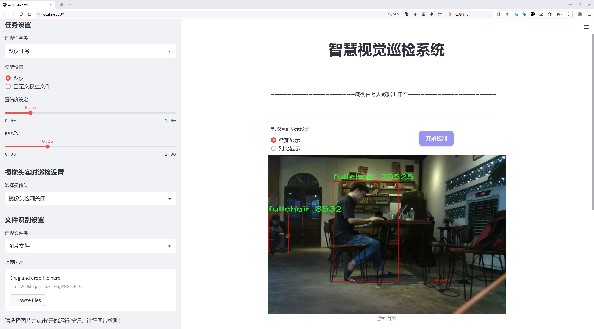
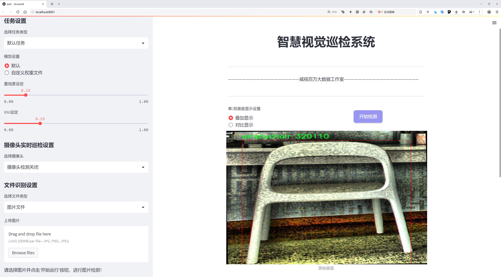
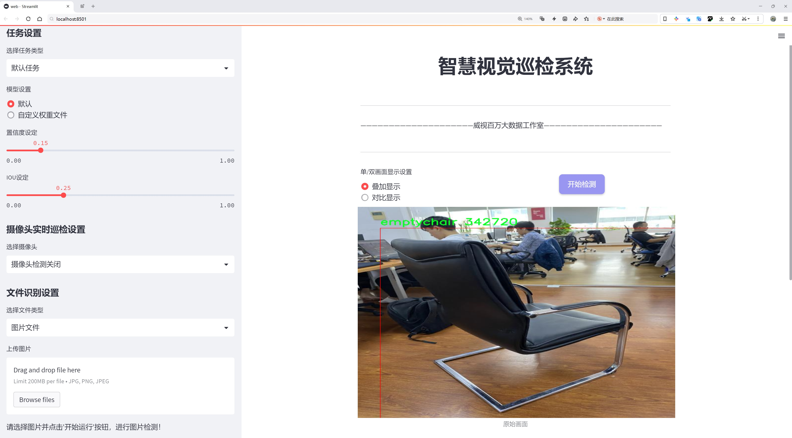
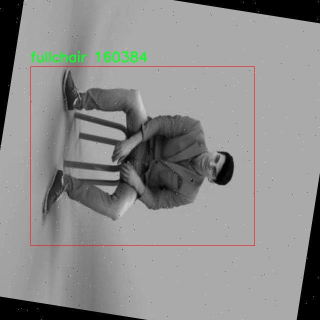
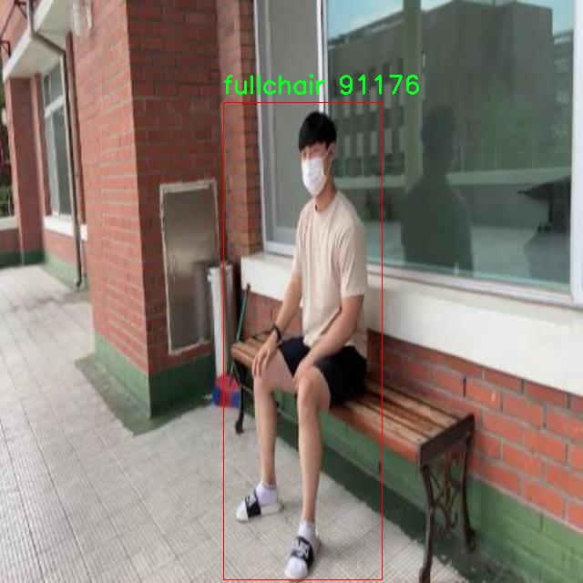
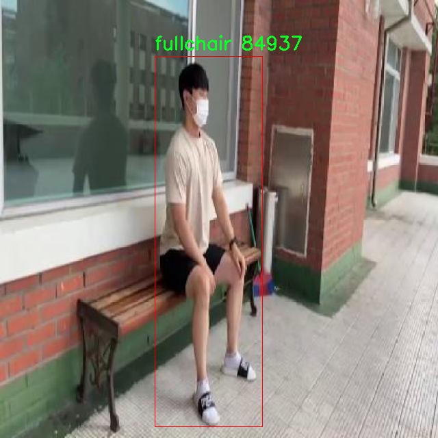
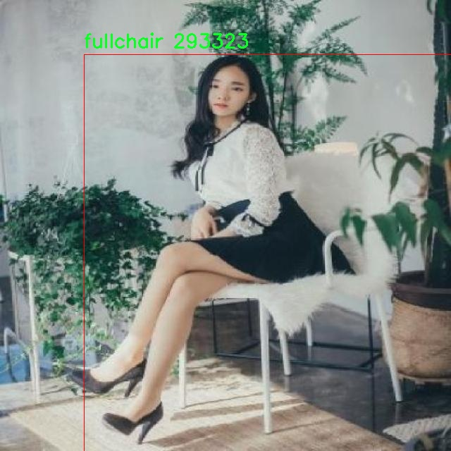

# 座椅空置状态检测检测系统源码分享
 # [一条龙教学YOLOV8标注好的数据集一键训练_70+全套改进创新点发刊_Web前端展示]

### 1.研究背景与意义

项目参考[AAAI Association for the Advancement of Artificial Intelligence](https://gitee.com/qunmasj/projects)

项目来源[AACV Association for the Advancement of Computer Vision](https://kdocs.cn/l/cszuIiCKVNis)

研究背景与意义

随着城市化进程的加快和人口密度的增加，公共场所如图书馆、机场、车站等地的座椅资源管理显得尤为重要。有效的座椅空置状态检测不仅能够提升空间利用效率，还能为用户提供更为便捷的服务体验。传统的座椅监测方法多依赖人工巡视或简单的传感器，这些方法不仅效率低下，而且在实时性和准确性上存在诸多不足。因此，基于计算机视觉的自动化检测系统逐渐成为研究的热点。

近年来，深度学习技术的迅猛发展为物体检测领域带来了新的机遇。YOLO（You Only Look Once）系列模型因其高效的实时检测能力和较高的准确率而受到广泛关注。YOLOv8作为该系列的最新版本，进一步优化了模型结构和算法，提升了检测精度和速度。通过对YOLOv8的改进，能够更好地适应座椅空置状态检测的需求，实现对“空椅”和“满椅”两类状态的准确识别。

本研究将基于改进的YOLOv8模型，构建一个高效的座椅空置状态检测系统。所使用的数据集包含8688张图像，涵盖了“emptychair”和“fullchair”两个类别。这一数据集的丰富性为模型的训练和测试提供了良好的基础，能够有效提升模型的泛化能力和鲁棒性。在数据集的构建过程中，图像的多样性和代表性是关键因素，这将确保模型在实际应用中的可靠性。

本研究的意义不仅在于技术层面的创新，更在于其在实际应用中的广泛前景。通过实现座椅空置状态的自动检测，可以有效减少人力成本，提高座椅资源的管理效率。同时，该系统的应用可以为用户提供实时的座椅状态信息，帮助他们快速找到可用座椅，提升用户体验。此外，该系统还可以与其他智能管理系统进行集成，形成一个全面的空间管理解决方案。

在社会层面，随着人们对公共资源管理的重视，座椅空置状态检测系统的研究将为推动智能城市建设提供有力支持。通过实现对公共座椅资源的智能化管理，可以更好地满足人们的需求，提升公共服务的质量和效率。这不仅有助于改善人们的生活环境，也为相关领域的研究提供了新的思路和方向。

综上所述，基于改进YOLOv8的座椅空置状态检测系统的研究，不仅具有重要的学术价值，也具有广泛的应用前景。通过深入探索这一领域，我们期待能够为公共空间的智能管理贡献一份力量，同时推动相关技术的进一步发展与应用。

### 2.图片演示







##### 注意：由于此博客编辑较早，上面“2.图片演示”和“3.视频演示”展示的系统图片或者视频可能为老版本，新版本在老版本的基础上升级如下：（实际效果以升级的新版本为准）

  （1）适配了YOLOV8的“目标检测”模型和“实例分割”模型，通过加载相应的权重（.pt）文件即可自适应加载模型。

  （2）支持“图片识别”、“视频识别”、“摄像头实时识别”三种识别模式。

  （3）支持“图片识别”、“视频识别”、“摄像头实时识别”三种识别结果保存导出，解决手动导出（容易卡顿出现爆内存）存在的问题，识别完自动保存结果并导出到tempDir中。

  （4）支持Web前端系统中的标题、背景图等自定义修改，后面提供修改教程。

  另外本项目提供训练的数据集和训练教程,暂不提供权重文件（best.pt）,需要您按照教程进行训练后实现图片演示和Web前端界面演示的效果。

### 3.视频演示

[3.1 视频演示](https://www.bilibili.com/video/BV1gxsYeaEe2/)

### 4.数据集信息展示

##### 4.1 本项目数据集详细数据（类别数＆类别名）

nc: 2
names: ['emptychair', 'fullchair']


##### 4.2 本项目数据集信息介绍

数据集信息展示

在本研究中，我们使用了名为“Seat”的数据集，旨在训练和改进YOLOv8模型，以实现高效的座椅空置状态检测。该数据集专注于两种主要类别：空椅子（emptychair）和满椅子（fullchair），共计包含两个类别（nc: 2）。这一简洁的类别设置使得模型能够在不同的场景中快速而准确地识别座椅的状态，从而为实际应用提供可靠的支持。

“Seat”数据集的构建过程经过精心设计，确保了数据的多样性和代表性。数据集中包含了各种环境下的座椅图像，例如会议室、教室、餐厅等不同场景。这些图像不仅涵盖了不同类型的椅子，如单人椅、双人椅以及沙发等，还考虑了不同的光照条件和角度变化，以增强模型的鲁棒性和适应性。通过这种方式，数据集能够模拟现实世界中可能遇到的各种情况，从而提高YOLOv8在实际应用中的表现。

在数据标注方面，所有图像均经过专业人员的仔细标注，确保每个类别的准确性。空椅子和满椅子的标注不仅包括基本的矩形框，还涵盖了座椅的具体位置和状态信息。这种细致的标注方式为模型的训练提供了丰富的上下文信息，使得YOLOv8能够更好地理解和学习不同座椅状态之间的差异。

此外，为了进一步提升模型的性能，数据集还包含了一些数据增强技术，如随机裁剪、旋转、颜色调整等。这些技术的应用不仅增加了数据集的多样性，还有效防止了模型的过拟合现象，使得YOLOv8在面对新数据时能够保持良好的检测能力。通过这些增强手段，模型在训练过程中能够学习到更为丰富的特征，从而在实际应用中表现出更高的准确率和更低的误报率。

在实验阶段，我们将“Seat”数据集分为训练集和验证集，以便于对模型的性能进行评估。训练集用于模型的学习和参数调整，而验证集则用于检测模型在未见数据上的泛化能力。通过这种方式，我们能够实时监控模型的训练进度，并根据验证结果不断优化模型的结构和参数设置。

总之，“Seat”数据集为改进YOLOv8的座椅空置状态检测系统提供了坚实的基础。其精心设计的类别设置、丰富的场景覆盖、严格的标注标准以及有效的数据增强策略，使得该数据集在训练过程中发挥了重要作用。随着模型的不断优化，我们期待能够实现更高效、更准确的座椅状态检测，为相关领域的应用提供更为强大的技术支持。










### 5.全套项目环境部署视频教程（零基础手把手教学）

[5.1 环境部署教程链接（零基础手把手教学）](https://www.ixigua.com/7404473917358506534?logTag=c807d0cbc21c0ef59de5)


[5.2 安装Python虚拟环境创建和依赖库安装视频教程链接（零基础手把手教学）](https://www.ixigua.com/7404474678003106304?logTag=1f1041108cd1f708b01a)

### 6.手把手YOLOV8训练视频教程（零基础小白有手就能学会）

[6.1 手把手YOLOV8训练视频教程（零基础小白有手就能学会）](https://www.ixigua.com/7404477157818401292?logTag=d31a2dfd1983c9668658)

### 7.70+种全套YOLOV8创新点代码加载调参视频教程（一键加载写好的改进模型的配置文件）

[7.1 70+种全套YOLOV8创新点代码加载调参视频教程（一键加载写好的改进模型的配置文件）](https://www.ixigua.com/7404478314661806627?logTag=29066f8288e3f4eea3a4)

### 8.70+种全套YOLOV8创新点原理讲解（非科班也可以轻松写刊发刊，V10版本正在科研待更新）

由于篇幅限制，每个创新点的具体原理讲解就不一一展开，具体见下列网址中的创新点对应子项目的技术原理博客网址【Blog】：


[8.1 70+种全套YOLOV8创新点原理讲解链接](https://gitee.com/qunmasj/good)

### 9.系统功能展示（检测对象为举例，实际内容以本项目数据集为准）

图9.1.系统支持检测结果表格显示

  图9.2.系统支持置信度和IOU阈值手动调节

  图9.3.系统支持自定义加载权重文件best.pt(需要你通过步骤5中训练获得)

  图9.4.系统支持摄像头实时识别

  图9.5.系统支持图片识别

  图9.6.系统支持视频识别

  图9.7.系统支持识别结果文件自动保存

  图9.8.系统支持Excel导出检测结果数据


### 10.原始YOLOV8算法原理

原始YOLOv8算法原理

YOLOv8算法自2023年1月10日推出以来，迅速成为计算机视觉领域中最为先进的目标检测与实例分割模型之一。作为YOLO系列的最新成员，YOLOv8在多个关键指标上超越了前辈模型，尤其是在精度和执行速度方面，展现出了卓越的性能。其设计理念继承了YOLOv5、YOLOv6和YOLOX等模型的优点，并在此基础上进行了全面的改进，旨在提供一种更加高效、简洁且易于工程化的解决方案。

YOLOv8的核心创新之一是其新的骨干网络结构。与YOLOv5相比，YOLOv8在特征提取层采用了更为轻量化的C2f模块，取代了原有的C3模块。C2f模块通过引入更多的跳层连接和Split操作，增强了特征的流动性和梯度的回传效率。这种设计不仅提升了模型对特征的提取能力，还有效地减少了计算量，使得YOLOv8在处理高分辨率图像和小目标检测时表现得更加出色。

在特征融合方面，YOLOv8继续采用了FPN（特征金字塔网络）与PAN（路径聚合网络）的结合结构。FPN的引入使得不同尺度的特征能够有效融合，提升了模型对多尺度目标的检测能力。YOLOv8在此基础上进行了改进，采用了BiFPN网络，进一步提高了特征信息的提取速度和精度。BiFPN的设计理念是通过高效的双向跨尺度连接，增强特征的加权融合能力，使得模型在处理复杂场景时能够更好地捕捉到关键信息。

YOLOv8的检测头结构也经历了显著的变革。传统的耦合头设计在YOLOv3和YOLOv5中广泛使用，但在YOLOv8中，检测头被重新设计为解耦头。这一变化使得分类和定位任务可以在两个独立的分支中进行处理，从而提高了任务的灵活性和准确性。解耦头的结构不仅简化了模型的设计，还提升了其在复杂场景下的表现能力，使得YOLOv8能够更有效地处理不同类别的目标。

在标签分配策略方面，YOLOv8采用了与YOLOv6相同的TOOD策略，取代了YOLOv5中依赖于候选框聚类的方式。这一动态标签分配策略能够更好地适应不同数据集的特征，避免了因数据集不足而导致的候选框不准确问题。YOLOv8通过直接使用目标框和目标分数，简化了标签分配的过程，从而提升了模型的训练效率和检测精度。

YOLOv8在损失函数的设计上也进行了创新，采用了Varifocal Loss（VFL）和CIoU Loss的组合。这种损失函数通过对正负样本进行不对称加权，增强了模型对高质量样本的关注度。具体而言，VFL通过对正样本的高IoU（交并比）赋予更大的权重，促使模型在训练过程中更关注于那些高质量的正例，从而有效提升了模型的平均精度（mAP）。而对负样本的处理则通过降低其对损失的贡献，进一步优化了模型的学习过程。

在数据预处理方面，YOLOv8依然延续了YOLOv5的策略，采用了多种增强手段，如马赛克增强、混合增强、空间扰动和颜色扰动等。这些增强技术不仅丰富了训练数据的多样性，还有效提升了模型的鲁棒性，使其在实际应用中能够更好地应对各种复杂环境。

综上所述，YOLOv8算法通过一系列的结构性改进和创新，成功地提升了目标检测和实例分割的性能。其在骨干网络、特征融合、检测头、标签分配及损失函数等多个方面的优化，使得YOLOv8不仅在精度上超越了前代模型，同时也在执行速度上表现出色。这些特性使得YOLOv8成为了一个极具潜力的工具，广泛适用于各类计算机视觉任务，尤其是在实时目标检测和高分辨率图像处理等领域。随着YOLOv8的推广和应用，预计其将在学术研究和工业界中发挥越来越重要的作用，推动计算机视觉技术的进一步发展。


### 11.项目核心源码讲解（再也不用担心看不懂代码逻辑）

#### 11.1 70+种YOLOv8算法改进源码大全和调试加载训练教程（非必要）\ultralytics\utils\plotting.py

以下是对代码中最核心部分的分析和详细注释。主要保留了 `Colors` 和 `Annotator` 类，以及一些与图像处理和可视化相关的函数。

```python
import numpy as np
from PIL import Image, ImageDraw, ImageFont
import cv2

class Colors:
    """
    颜色类，用于处理颜色调色板。
    """

    def __init__(self):
        """初始化颜色调色板，使用16种预定义的颜色。"""
        hexs = ('FF3838', 'FF9D97', 'FF701F', 'FFB21D', 'CFD231', '48F90A', '92CC17', '3DDB86', 
                '1A9334', '00D4BB', '2C99A8', '00C2FF', '344593', '6473FF', '0018EC', 
                '8438FF', '520085', 'CB38FF', 'FF95C8', 'FF37C7')
        # 将十六进制颜色转换为RGB格式
        self.palette = [self.hex2rgb(f'#{c}') for c in hexs]
        self.n = len(self.palette)  # 颜色数量

    def __call__(self, i, bgr=False):
        """根据索引返回颜色，支持BGR格式。"""
        c = self.palette[int(i) % self.n]  # 获取颜色
        return (c[2], c[1], c[0]) if bgr else c  # 如果需要BGR格式，则反转颜色顺序

    @staticmethod
    def hex2rgb(h):
        """将十六进制颜色转换为RGB格式。"""
        return tuple(int(h[1 + i:1 + i + 2], 16) for i in (0, 2, 4))


class Annotator:
    """
    注释类，用于在图像上绘制边框、文本和关键点。
    """

    def __init__(self, im, line_width=None, font_size=None, font='Arial.ttf', pil=False):
        """初始化Annotator类，设置图像和绘制参数。"""
        self.im = im if isinstance(im, Image.Image) else Image.fromarray(im)  # 转换为PIL图像
        self.draw = ImageDraw.Draw(self.im)  # 创建绘图对象
        self.lw = line_width or 2  # 线宽
        self.font = ImageFont.truetype(font, font_size or 12)  # 字体设置

    def box_label(self, box, label='', color=(128, 128, 128), txt_color=(255, 255, 255)):
        """在图像上绘制边框和标签。"""
        self.draw.rectangle(box, width=self.lw, outline=color)  # 绘制边框
        if label:
            w, h = self.font.getsize(label)  # 获取文本宽高
            self.draw.rectangle((box[0], box[1] - h, box[0] + w + 1, box[1] + 1), fill=color)  # 绘制标签背景
            self.draw.text((box[0], box[1] - h), label, fill=txt_color, font=self.font)  # 绘制文本

    def kpts(self, kpts, radius=5):
        """在图像上绘制关键点。"""
        for k in kpts:
            x, y = int(k[0]), int(k[1])  # 获取关键点坐标
            self.draw.ellipse((x - radius, y - radius, x + radius, y + radius), fill=(255, 0, 0))  # 绘制关键点

    def result(self):
        """返回注释后的图像。"""
        return np.asarray(self.im)  # 转换为numpy数组并返回


def save_one_box(xyxy, im, file='im.jpg', gain=1.02, pad=10, square=False, save=True):
    """
    根据给定的边界框保存图像的裁剪部分。
    
    参数:
        xyxy (list): 边界框坐标 [x1, y1, x2, y2]。
        im (numpy.ndarray): 输入图像。
        file (str): 保存的文件名。
        gain (float): 边界框大小的放大倍数。
        pad (int): 边界框的填充像素。
        square (bool): 是否将裁剪区域变为正方形。
        save (bool): 是否保存裁剪的图像。
    
    返回:
        numpy.ndarray: 裁剪的图像。
    """
    # 将边界框转换为xywh格式
    b = ops.xyxy2xywh(torch.tensor(xyxy).view(-1, 4))  
    if square:
        b[:, 2:] = b[:, 2:].max(1)[0].unsqueeze(1)  # 尝试将矩形转换为正方形
    b[:, 2:] = b[:, 2:] * gain + pad  # 计算新的边界框
    xyxy = ops.xywh2xyxy(b).long()  # 转换回xyxy格式
    crop = im[int(xyxy[0, 1]):int(xyxy[0, 3]), int(xyxy[0, 0]):int(xyxy[0, 2]), :]  # 裁剪图像
    if save:
        Image.fromarray(crop).save(file)  # 保存裁剪的图像
    return crop  # 返回裁剪的图像
```

### 代码核心部分分析
1. **Colors 类**: 该类负责处理颜色的转换和调色板的管理。它将十六进制颜色转换为RGB格式，并提供通过索引获取颜色的功能。

2. **Annotator 类**: 该类用于在图像上绘制边框、文本和关键点。它支持使用PIL库进行图像处理，提供了绘制矩形和文本的功能。

3. **save_one_box 函数**: 该函数用于根据给定的边界框裁剪图像并保存。它支持调整裁剪区域的大小和填充。

这些核心部分构成了图像处理和可视化的基础，能够实现对目标检测结果的标注和展示。

这个文件是一个用于YOLOv8算法的可视化工具，主要用于绘制图像、标注框、关键点和掩膜等。它包含多个类和函数，帮助用户在训练和推理过程中可视化模型的输出和数据。

首先，文件导入了一些必要的库，包括`cv2`（OpenCV）、`matplotlib`、`numpy`、`torch`等，这些库提供了图像处理和绘图的功能。`PIL`库用于处理图像和文本绘制。

文件中定义了一个`Colors`类，用于管理颜色调色板。该类包含一个初始化方法，定义了一组十六进制颜色，并提供了将十六进制颜色转换为RGB格式的方法。`__call__`方法允许通过索引获取颜色，支持BGR格式的输出。

接下来是`Annotator`类，它用于在图像上绘制标注，包括边框、文本、关键点和掩膜。初始化方法中接收图像、线宽、字体等参数，并根据使用的绘图库（PIL或OpenCV）设置相应的绘制方式。该类包含多个方法，例如`box_label`用于绘制边框和标签，`masks`用于绘制掩膜，`kpts`用于绘制关键点，`rectangle`和`text`用于绘制矩形和文本。

文件还定义了一些函数，例如`plot_labels`用于绘制训练标签的统计信息，`save_one_box`用于保存图像的裁剪部分，`plot_images`用于绘制图像网格，`plot_results`用于从CSV文件中绘制训练结果，`plt_color_scatter`用于绘制基于2D直方图的散点图，`plot_tune_results`用于绘制超参数调优结果，`output_to_target`用于将模型输出转换为目标格式，`feature_visualization`用于可视化模型的特征图。

这些功能使得用户能够方便地查看模型的训练过程、结果和性能，从而更好地理解和调试YOLOv8算法。整体来看，这个文件是YOLOv8项目中一个重要的工具，提供了丰富的可视化功能，帮助用户在不同阶段分析和展示数据。

#### 11.2 ui.py

以下是代码中最核心的部分，并附上详细的中文注释：

```python
import sys
import subprocess

def run_script(script_path):
    """
    使用当前 Python 环境运行指定的脚本。

    Args:
        script_path (str): 要运行的脚本路径

    Returns:
        None
    """
    # 获取当前 Python 解释器的路径
    python_path = sys.executable

    # 构建运行命令，使用 streamlit 运行指定的脚本
    command = f'"{python_path}" -m streamlit run "{script_path}"'

    # 执行命令，并等待其完成
    result = subprocess.run(command, shell=True)
    
    # 检查命令执行的返回码，如果不为0则表示出错
    if result.returncode != 0:
        print("脚本运行出错。")

# 实例化并运行应用
if __name__ == "__main__":
    # 指定要运行的脚本路径
    script_path = "web.py"  # 这里可以替换为实际的脚本路径

    # 调用函数运行脚本
    run_script(script_path)
```

### 代码注释说明：
1. **导入模块**：
   - `sys`：用于访问与 Python 解释器紧密相关的变量和函数。
   - `subprocess`：用于创建新进程、连接到它们的输入/输出/错误管道，并获得它们的返回码。

2. **定义 `run_script` 函数**：
   - 该函数接收一个脚本路径作为参数，并使用当前 Python 环境来运行该脚本。

3. **获取 Python 解释器路径**：
   - `sys.executable` 返回当前 Python 解释器的完整路径，这样可以确保使用正确的 Python 环境来运行脚本。

4. **构建命令**：
   - 使用 f-string 构建一个命令字符串，该命令使用 `streamlit` 模块来运行指定的脚本。

5. **执行命令**：
   - `subprocess.run` 方法用于执行构建的命令，并等待命令完成。`shell=True` 允许在 shell 中执行命令。

6. **检查返回码**：
   - 通过检查 `result.returncode` 来判断命令是否成功执行。如果返回码不为0，表示执行过程中出现了错误。

7. **主程序入口**：
   - `if __name__ == "__main__":` 确保只有在直接运行该脚本时才会执行以下代码。
   - 指定要运行的脚本路径，并调用 `run_script` 函数来执行该脚本。

这个程序文件的主要功能是通过当前的 Python 环境来运行一个指定的脚本，具体是使用 Streamlit 这个库来启动一个 Web 应用。程序首先导入了必要的模块，包括 `sys`、`os` 和 `subprocess`，以及一个自定义的 `abs_path` 函数，用于获取脚本的绝对路径。

在 `run_script` 函数中，首先获取当前 Python 解释器的路径，这样可以确保在正确的环境中运行脚本。接着，构建一个命令字符串，该命令使用 Streamlit 的 `run` 功能来执行指定的脚本。这个命令通过 `subprocess.run` 方法执行，`shell=True` 参数允许在 shell 中运行该命令。

如果脚本运行过程中出现错误，程序会检查返回码并打印出相应的错误信息。

在文件的最后部分，使用 `if __name__ == "__main__":` 语句来确保只有在直接运行该文件时才会执行后面的代码。这里指定了要运行的脚本路径为 `web.py`，并调用 `run_script` 函数来启动这个脚本。

总体来说，这个程序提供了一种简便的方式来启动一个基于 Streamlit 的 Web 应用，确保在当前 Python 环境中运行，方便用户进行开发和测试。

#### 11.3 code\ultralytics\models\rtdetr\predict.py

以下是代码中最核心的部分，并附上详细的中文注释：

```python
import torch
from ultralytics.data.augment import LetterBox
from ultralytics.engine.predictor import BasePredictor
from ultralytics.engine.results import Results
from ultralytics.utils import ops

class RTDETRPredictor(BasePredictor):
    """
    RT-DETR (Real-Time Detection Transformer) 预测器，扩展自 BasePredictor 类，用于使用百度的 RT-DETR 模型进行预测。

    该类利用视觉变换器的强大功能，提供实时物体检测，同时保持高精度。支持高效的混合编码和 IoU 感知查询选择等关键特性。
    """

    def postprocess(self, preds, img, orig_imgs):
        """
        对模型的原始预测结果进行后处理，以生成边界框和置信度分数。

        该方法根据置信度和类进行过滤，如果在 `self.args` 中指定了类。

        参数:
            preds (torch.Tensor): 模型的原始预测结果。
            img (torch.Tensor): 处理后的输入图像。
            orig_imgs (list or torch.Tensor): 原始的未处理图像。

        返回:
            (list[Results]): 包含后处理的边界框、置信度分数和类标签的 Results 对象列表。
        """
        # 获取预测结果的维度
        nd = preds[0].shape[-1]
        # 分割边界框和分数
        bboxes, scores = preds[0].split((4, nd - 4), dim=-1)

        # 如果输入图像不是列表，则转换为 numpy 格式
        if not isinstance(orig_imgs, list):
            orig_imgs = ops.convert_torch2numpy_batch(orig_imgs)

        results = []
        # 遍历每个边界框
        for i, bbox in enumerate(bboxes):
            # 将边界框从 xywh 格式转换为 xyxy 格式
            bbox = ops.xywh2xyxy(bbox)
            # 获取每个边界框的最大分数和对应的类
            score, cls = scores[i].max(-1, keepdim=True)
            # 根据置信度进行过滤
            idx = score.squeeze(-1) > self.args.conf
            # 如果指定了类，则进一步过滤
            if self.args.classes is not None:
                idx = (cls == torch.tensor(self.args.classes, device=cls.device)).any(1) & idx
            # 过滤后的预测结果
            pred = torch.cat([bbox, score, cls], dim=-1)[idx]
            orig_img = orig_imgs[i]
            oh, ow = orig_img.shape[:2]
            # 将边界框的坐标转换为原始图像的尺度
            pred[..., [0, 2]] *= ow
            pred[..., [1, 3]] *= oh
            img_path = self.batch[0][i]
            # 将结果添加到列表中
            results.append(Results(orig_img, path=img_path, names=self.model.names, boxes=pred))
        return results

    def pre_transform(self, im):
        """
        在将输入图像送入模型进行推理之前，对其进行预处理。输入图像被调整为方形的长宽比并填充。

        参数:
            im (list[np.ndarray] | torch.Tensor): 输入图像，形状为 (N,3,h,w) 的张量，或 [(h,w,3) x N] 的列表。

        返回:
            (list): 预处理后的图像列表，准备进行模型推理。
        """
        # 创建 LetterBox 对象，用于调整图像大小
        letterbox = LetterBox(self.imgsz, auto=False, scaleFill=True)
        # 对每个图像进行调整
        return [letterbox(image=x) for x in im]
```

### 代码核心部分说明：
1. **RTDETRPredictor 类**：这是一个用于实时物体检测的预测器，继承自 `BasePredictor` 类，利用视觉变换器进行高效的物体检测。
2. **postprocess 方法**：对模型的原始预测结果进行后处理，生成最终的边界框和置信度分数，并根据置信度和类进行过滤。
3. **pre_transform 方法**：对输入图像进行预处理，确保其为方形并适合模型输入。

这个程序文件 `predict.py` 是 Ultralytics YOLO 项目的一部分，主要实现了 RT-DETR（实时检测变换器）模型的预测功能。该文件定义了一个名为 `RTDETRPredictor` 的类，继承自 `BasePredictor` 类，用于利用百度的 RT-DETR 模型进行对象检测。

在类的文档字符串中，简要介绍了 RT-DETR 模型的特点，包括其高效的混合编码和 IoU（交并比）感知查询选择能力。该模型结合了视觉变换器的优势，能够在保持高准确率的同时实现实时对象检测。文档中还提供了一个使用示例，展示了如何实例化 `RTDETRPredictor` 并进行预测。

该类有两个主要的属性：`imgsz`，表示推理时的图像大小（必须是正方形并且填充比例正确）；`args`，用于存储传递给预测器的参数。

在 `postprocess` 方法中，处理模型的原始预测结果，以生成边界框和置信度分数。该方法首先将预测结果分割为边界框和分数，并根据置信度和类别进行过滤。对于每个边界框，方法将其坐标从中心点宽高格式转换为左上角和右下角格式，并根据置信度阈值和指定的类别进行筛选。最终，方法返回一个包含处理后结果的列表，每个结果都包含原始图像、路径、类别名称和边界框信息。

`pre_transform` 方法用于在将输入图像送入模型进行推理之前进行预处理。该方法使用 `LetterBox` 类将输入图像调整为正方形，确保图像的宽高比适合模型要求。输入图像可以是一个张量或一个图像列表，方法返回经过预处理的图像列表，准备好进行模型推理。

整体来看，这个文件的主要功能是为 RT-DETR 模型提供预测能力，包括输入图像的预处理和输出结果的后处理，使得用户能够方便地进行对象检测任务。

#### 11.4 code\ultralytics\trackers\basetrack.py

```python
# Ultralytics YOLO 🚀, AGPL-3.0 license
"""该模块定义了YOLO中对象跟踪的基本类和结构。"""

from collections import OrderedDict
import numpy as np

class TrackState:
    """
    表示被跟踪对象可能状态的枚举类。

    属性：
        New (int): 对象被新检测到的状态。
        Tracked (int): 对象在后续帧中成功跟踪的状态。
        Lost (int): 对象不再被跟踪的状态。
        Removed (int): 对象被从跟踪中移除的状态。
    """
    New = 0          # 新检测到的状态
    Tracked = 1      # 成功跟踪的状态
    Lost = 2         # 丢失的状态
    Removed = 3      # 被移除的状态


class BaseTrack:
    """
    对象跟踪的基类，提供基础属性和方法。

    属性：
        _count (int): 类级别的唯一跟踪ID计数器。
        track_id (int): 跟踪的唯一标识符。
        is_activated (bool): 标志跟踪是否当前处于激活状态。
        state (TrackState): 跟踪的当前状态。
        history (OrderedDict): 跟踪状态的有序历史记录。
        features (list): 从对象中提取的用于跟踪的特征列表。
        curr_feature (any): 当前被跟踪对象的特征。
        score (float): 跟踪的置信度分数。
        start_frame (int): 跟踪开始的帧编号。
        frame_id (int): 跟踪处理的最新帧ID。
        time_since_update (int): 自上次更新以来经过的帧数。
        location (tuple): 在多摄像头跟踪中的对象位置。

    方法：
        end_frame: 返回对象被跟踪的最后一帧ID。
        next_id: 增加并返回下一个全局跟踪ID。
        activate: 抽象方法，用于激活跟踪。
        predict: 抽象方法，用于预测跟踪的下一个状态。
        update: 抽象方法，用于使用新数据更新跟踪。
        mark_lost: 将跟踪标记为丢失。
        mark_removed: 将跟踪标记为已移除。
        reset_id: 重置全局跟踪ID计数器。
    """

    _count = 0  # 初始化全局跟踪ID计数器

    def __init__(self):
        """初始化一个新的跟踪对象，分配唯一ID和基础跟踪属性。"""
        self.track_id = 0  # 跟踪ID
        self.is_activated = False  # 跟踪是否激活
        self.state = TrackState.New  # 初始状态为新检测
        self.history = OrderedDict()  # 跟踪状态历史
        self.features = []  # 特征列表
        self.curr_feature = None  # 当前特征
        self.score = 0  # 置信度分数
        self.start_frame = 0  # 跟踪开始帧
        self.frame_id = 0  # 最新帧ID
        self.time_since_update = 0  # 自上次更新以来的帧数
        self.location = (np.inf, np.inf)  # 对象位置初始化为无穷大

    @property
    def end_frame(self):
        """返回跟踪的最后一帧ID。"""
        return self.frame_id

    @staticmethod
    def next_id():
        """增加并返回全局跟踪ID计数器。"""
        BaseTrack._count += 1
        return BaseTrack._count

    def activate(self, *args):
        """抽象方法，用于激活跟踪，需实现具体逻辑。"""
        raise NotImplementedError

    def predict(self):
        """抽象方法，用于预测跟踪的下一个状态，需实现具体逻辑。"""
        raise NotImplementedError

    def update(self, *args, **kwargs):
        """抽象方法，用于使用新观察更新跟踪，需实现具体逻辑。"""
        raise NotImplementedError

    def mark_lost(self):
        """将跟踪标记为丢失。"""
        self.state = TrackState.Lost

    def mark_removed(self):
        """将跟踪标记为已移除。"""
        self.state = TrackState.Removed

    @staticmethod
    def reset_id():
        """重置全局跟踪ID计数器。"""
        BaseTrack._count = 0
``` 

以上代码是YOLO对象跟踪的基础类和状态定义，提供了跟踪对象的管理和状态更新的基本框架。

这个程序文件是一个用于对象跟踪的基础模块，主要用于与YOLO（You Only Look Once）目标检测算法结合使用。文件中定义了一个跟踪状态的枚举类和一个基础跟踪类。

首先，`TrackState`类定义了对象跟踪的可能状态，包括“新检测”（New）、“被跟踪”（Tracked）、“丢失”（Lost）和“已移除”（Removed）。这些状态用于表示对象在跟踪过程中的不同阶段。

接下来，`BaseTrack`类是一个对象跟踪的基础类，提供了一些基础属性和方法。该类中包含了一个类级别的计数器，用于生成唯一的跟踪ID。每个跟踪对象都有其独特的ID、激活状态、当前状态、历史状态记录、提取的特征、当前特征、置信度分数、开始跟踪的帧编号、最近处理的帧ID、上次更新后的帧数以及在多摄像头跟踪中的位置。

在构造函数中，初始化了跟踪对象的各项属性，确保每个新创建的跟踪对象都有一个唯一的ID和基础的跟踪属性。

`BaseTrack`类还定义了一些方法，包括获取最后一帧ID的方法、生成下一个跟踪ID的方法、激活跟踪的方法、预测下一个状态的方法、更新跟踪的方法、标记为丢失和已移除的方法，以及重置全局跟踪ID计数器的方法。需要注意的是，激活、预测和更新方法被定义为抽象方法，意味着具体的跟踪实现需要在子类中实现这些方法。

总的来说，这个模块为YOLO目标检测算法中的对象跟踪提供了一个基础框架，允许开发者在此基础上扩展和实现具体的跟踪逻辑。

#### 11.5 70+种YOLOv8算法改进源码大全和调试加载训练教程（非必要）\ultralytics\nn\extra_modules\__init__.py

以下是保留的核心部分，并附上详细的中文注释：

```python
# 导入模块
# 从当前包中导入多个模块，这些模块可能包含构建神经网络所需的不同组件。

from .afpn import *  # 导入自适应特征金字塔网络（AFPN）相关的功能或类
from .attention import *  # 导入注意力机制相关的功能或类
from .block import *  # 导入网络中使用的基本模块或块
from .head import *  # 导入网络的头部部分，通常用于输出层
from .rep_block import *  # 导入重复块，可能用于构建深层网络
from .kernel_warehouse import *  # 导入内核仓库，可能用于存储和管理卷积核
from .dynamic_snake_conv import *  # 导入动态蛇形卷积，可能用于特定的卷积操作
from .orepa import *  # 导入OREPA（可能是某种特定的网络结构或算法）
from .RFAConv import *  # 导入RFA卷积，可能是某种特定的卷积操作
```

### 注释说明：
1. **模块导入**：使用`from .module import *`的方式导入模块，表示这些模块在当前包内。`*`表示导入模块中的所有公共类和函数。
2. **功能性**：每个导入的模块可能实现了特定的功能，例如网络结构、卷积操作、注意力机制等，通常在构建深度学习模型时会用到。
3. **可扩展性**：通过导入不同的模块，可以灵活地组合和扩展网络结构，以满足不同的任务需求。

这个程序文件是一个Python模块的初始化文件，通常命名为`__init__.py`，它的主要作用是将当前目录下的其他模块导入到这个包中，使得用户在使用这个包时可以直接访问这些模块。

在这个文件中，使用了多个`from .module_name import *`语句，这意味着它从当前目录下的不同模块导入了所有的公共类和函数。具体来说，这里导入了以下模块：

1. `afpn`：可能与特征金字塔网络（FPN）相关，通常用于处理不同尺度的特征图。
2. `attention`：可能实现了一些注意力机制，用于增强模型对重要特征的关注。
3. `block`：可能定义了一些基本的网络块，通常是构建深度学习模型的基础单元。
4. `head`：可能与模型的输出层或头部结构相关，负责将特征映射转换为最终的预测结果。
5. `rep_block`：可能是某种重复结构的网络块，常用于构建深层网络。
6. `kernel_warehouse`：可能与卷积核的管理或生成有关，可能用于动态调整卷积操作。
7. `dynamic_snake_conv`：可能实现了一种动态的卷积结构，可能是针对特定任务优化的卷积方式。
8. `orepa`：可能是某种特定的算法或结构，具体功能需要查看该模块的实现。
9. `RFAConv`：可能是实现了一种新的卷积方式，可能与注意力机制或特征融合有关。

通过这个初始化文件，用户可以方便地使用这些模块中的功能，而不需要逐个导入。这样的设计使得代码结构更加清晰，模块化程度更高，有助于维护和扩展。

#### 11.6 train.py

以下是代码中最核心的部分，并附上详细的中文注释：

```python
class DetectionTrainer(BaseTrainer):
    """
    扩展自 BaseTrainer 类的检测模型训练类。
    用于训练 YOLO 检测模型。
    """

    def build_dataset(self, img_path, mode="train", batch=None):
        """
        构建 YOLO 数据集。

        参数:
            img_path (str): 包含图像的文件夹路径。
            mode (str): 模式，`train` 表示训练模式，`val` 表示验证模式。
            batch (int, optional): 批次大小，仅用于 `rect` 模式。默认为 None。
        """
        gs = max(int(de_parallel(self.model).stride.max() if self.model else 0), 32)
        return build_yolo_dataset(self.args, img_path, batch, self.data, mode=mode, rect=mode == "val", stride=gs)

    def get_dataloader(self, dataset_path, batch_size=16, rank=0, mode="train"):
        """构造并返回数据加载器。"""
        assert mode in ["train", "val"]  # 确保模式是训练或验证
        with torch_distributed_zero_first(rank):  # 仅在 DDP 中初始化数据集 *.cache 一次
            dataset = self.build_dataset(dataset_path, mode, batch_size)  # 构建数据集
        shuffle = mode == "train"  # 训练模式下打乱数据
        if getattr(dataset, "rect", False) and shuffle:
            LOGGER.warning("WARNING ⚠️ 'rect=True' 与 DataLoader 的 shuffle 不兼容，设置 shuffle=False")
            shuffle = False
        workers = self.args.workers if mode == "train" else self.args.workers * 2  # 设置工作线程数
        return build_dataloader(dataset, batch_size, workers, shuffle, rank)  # 返回数据加载器

    def preprocess_batch(self, batch):
        """对一批图像进行预处理，包括缩放和转换为浮点数。"""
        batch["img"] = batch["img"].to(self.device, non_blocking=True).float() / 255  # 转换为浮点数并归一化
        if self.args.multi_scale:  # 如果启用多尺度
            imgs = batch["img"]
            sz = (
                random.randrange(self.args.imgsz * 0.5, self.args.imgsz * 1.5 + self.stride)
                // self.stride
                * self.stride
            )  # 随机选择尺寸
            sf = sz / max(imgs.shape[2:])  # 计算缩放因子
            if sf != 1:  # 如果缩放因子不为1
                ns = [
                    math.ceil(x * sf / self.stride) * self.stride for x in imgs.shape[2:]
                ]  # 计算新的形状
                imgs = nn.functional.interpolate(imgs, size=ns, mode="bilinear", align_corners=False)  # 进行插值缩放
            batch["img"] = imgs  # 更新批次图像
        return batch

    def get_model(self, cfg=None, weights=None, verbose=True):
        """返回 YOLO 检测模型。"""
        model = DetectionModel(cfg, nc=self.data["nc"], verbose=verbose and RANK == -1)  # 创建检测模型
        if weights:
            model.load(weights)  # 加载权重
        return model

    def get_validator(self):
        """返回用于 YOLO 模型验证的 DetectionValidator。"""
        self.loss_names = "box_loss", "cls_loss", "dfl_loss"  # 定义损失名称
        return yolo.detect.DetectionValidator(
            self.test_loader, save_dir=self.save_dir, args=copy(self.args), _callbacks=self.callbacks
        )  # 返回验证器

    def plot_training_samples(self, batch, ni):
        """绘制带有注释的训练样本。"""
        plot_images(
            images=batch["img"],
            batch_idx=batch["batch_idx"],
            cls=batch["cls"].squeeze(-1),
            bboxes=batch["bboxes"],
            paths=batch["im_file"],
            fname=self.save_dir / f"train_batch{ni}.jpg",
            on_plot=self.on_plot,
        )  # 绘制图像

    def plot_metrics(self):
        """从 CSV 文件中绘制指标。"""
        plot_results(file=self.csv, on_plot=self.on_plot)  # 保存结果图
```

### 代码核心部分说明：
1. **DetectionTrainer 类**：这是一个用于训练 YOLO 检测模型的类，继承自 `BaseTrainer`。
2. **build_dataset 方法**：构建 YOLO 数据集，接受图像路径、模式和批次大小作为参数。
3. **get_dataloader 方法**：构造数据加载器，确保在训练模式下打乱数据，并根据模式设置工作线程数。
4. **preprocess_batch 方法**：对输入的图像批次进行预处理，包括归一化和多尺度处理。
5. **get_model 方法**：返回一个 YOLO 检测模型，可以选择加载预训练权重。
6. **get_validator 方法**：返回一个用于模型验证的验证器。
7. **plot_training_samples 和 plot_metrics 方法**：用于可视化训练样本和绘制训练指标。

这个程序文件 `train.py` 是一个用于训练目标检测模型的脚本，主要基于 YOLO（You Only Look Once）架构。程序通过继承 `BaseTrainer` 类，定义了一个 `DetectionTrainer` 类，专门用于处理目标检测任务。

在文件的开头，导入了一些必要的库和模块，包括数学运算、随机数生成、深度学习框架 PyTorch 相关的模块，以及 Ultralytics 提供的各种工具和函数。接下来，`DetectionTrainer` 类中定义了多个方法，具体功能如下：

`build_dataset` 方法用于构建 YOLO 数据集。它接收图像路径、模式（训练或验证）和批量大小作为参数，并根据模型的步幅设置生成数据集。

`get_dataloader` 方法则负责构建数据加载器。它会根据模式（训练或验证）来决定是否打乱数据，并设置工作线程的数量。这个方法确保在分布式训练时只初始化一次数据集。

`preprocess_batch` 方法用于对图像批次进行预处理，包括将图像缩放到适当的大小并转换为浮点数格式。这个方法还支持多尺度训练，通过随机选择图像大小来增强模型的鲁棒性。

`set_model_attributes` 方法用于设置模型的属性，包括类别数量和类别名称。这些信息会被附加到模型中，以便在训练过程中使用。

`get_model` 方法用于返回一个 YOLO 检测模型。如果提供了权重文件，它会加载这些权重。

`get_validator` 方法返回一个用于模型验证的 `DetectionValidator` 实例，能够计算并记录损失值。

`label_loss_items` 方法返回一个包含训练损失项的字典，便于监控训练过程中的损失情况。

`progress_string` 方法生成一个格式化的字符串，显示训练进度，包括当前的轮次、GPU 内存使用情况、损失值、实例数量和图像大小。

`plot_training_samples` 方法用于绘制训练样本及其标注，便于可视化训练数据的质量。

最后，`plot_metrics` 和 `plot_training_labels` 方法用于绘制训练过程中的各种指标和标签，帮助用户分析模型的训练效果。

总体而言，这个文件提供了一个完整的框架，用于训练 YOLO 模型，包括数据集构建、数据加载、模型设置、训练过程监控和结果可视化等功能。

### 12.系统整体结构（节选）

### 整体功能和构架概括

该项目是一个基于 YOLOv8 的目标检测和跟踪框架，包含多个模块和工具，旨在提供一个完整的解决方案用于训练、推理和可视化。项目的主要功能包括：

1. **模型训练**：通过 `train.py` 文件，用户可以配置和启动模型的训练过程，包括数据集的构建、数据加载、模型的初始化和训练过程的监控。
2. **模型推理**：通过 `predict.py` 文件，用户可以使用训练好的模型进行目标检测，处理输入图像并生成预测结果。
3. **对象跟踪**：通过 `basetrack.py` 文件，提供了基础的对象跟踪功能，允许在检测过程中跟踪目标。
4. **可视化工具**：通过 `plotting.py` 文件，用户可以可视化训练过程中的数据、损失和预测结果，帮助分析模型性能。
5. **模块化设计**：项目采用模块化设计，使用 `__init__.py` 文件将不同功能的模块组织在一起，便于管理和扩展。

### 文件功能整理表

| 文件路径                                                                                      | 功能描述                                                                                           |
|-----------------------------------------------------------------------------------------------|----------------------------------------------------------------------------------------------------|
| `70+种YOLOv8算法改进源码大全和调试加载训练教程（非必要）\ultralytics\utils\plotting.py`       | 提供可视化工具，用于绘制图像、标注框、关键点和掩膜等，帮助用户分析训练过程和结果。                  |
| `ui.py`                                                                                      | 启动一个基于 Streamlit 的 Web 应用，便于用户进行模型的交互式测试和可视化。                         |
| `code\ultralytics\models\rtdetr\predict.py`                                                 | 实现 RT-DETR 模型的推理功能，包括输入图像的预处理和输出结果的后处理。                           |
| `code\ultralytics\trackers\basetrack.py`                                                    | 提供基础的对象跟踪功能，定义了跟踪状态和基础跟踪类，支持与检测模型结合使用。                     |
| `70+种YOLOv8算法改进源码大全和调试加载训练教程（非必要）\ultralytics\nn\extra_modules\__init__.py` | 初始化文件，导入当前目录下的多个模块，便于用户访问和使用。                                       |
| `train.py`                                                                                   | 负责模型的训练过程，包括数据集构建、数据加载、模型初始化和训练监控等功能。                     |
| `70+种YOLOv8算法改进源码大全和调试加载训练教程（非必要）\ultralytics\utils\__init__.py`      | 初始化文件，导入工具模块，提供可用的工具函数和类。                                              |
| `70+种YOLOv8算法改进源码大全和调试加载训练教程（非必要）\ultralytics\models\rtdetr\val.py`  | 实现模型验证功能，计算并记录模型在验证集上的性能指标。                                          |
| `70+种YOLOv8算法改进源码大全和调试加载训练教程（非必要）\ultralytics\nn\extra_modules\ops_dcnv3\modules\__init__.py` | 初始化文件，导入特定的操作模块，支持深度学习模型的扩展。                                         |
| `70+种YOLOv8算法改进源码大全和调试加载训练教程（非必要）\ultralytics\utils\dist.py`        | 提供分布式训练相关的工具和函数，支持多GPU训练。                                                  |
| `code\ultralytics\nn\modules\utils.py`                                                      | 包含一些实用工具函数，支持模型构建和训练过程中的各种操作。                                       |
| `code\ultralytics\utils\torch_utils.py`                                                    | 提供与 PyTorch 相关的工具函数，支持模型训练和推理过程中的各种操作。                              |
| `70+种YOLOv8算法改进源码大全和调试加载训练教程（非必要）\ultralytics\solutions\ai_gym.py`   | 提供与 AI Gym 相关的解决方案，可能用于训练和测试模型的环境设置。                                 |

这个表格总结了每个文件的主要功能，帮助用户快速了解项目的结构和各个模块的作用。

注意：由于此博客编辑较早，上面“11.项目核心源码讲解（再也不用担心看不懂代码逻辑）”中部分代码可能会优化升级，仅供参考学习，完整“训练源码”、“Web前端界面”和“70+种创新点源码”以“13.完整训练+Web前端界面+70+种创新点源码、数据集获取”的内容为准。

### 13.完整训练+Web前端界面+70+种创新点源码、数据集获取


# [下载链接：https://mbd.pub/o/bread/ZpuZlJZt](https://mbd.pub/o/bread/ZpuZlJZt)